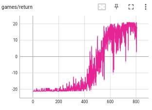

# PTSA-MCTS


Monte Carlo Tree Search (MCTS) algorithms such as AlphaGo and MuZero
have achieved superhuman performance in many challenging tasks. However, the
computational complexity of MCTS-based algorithms is influenced by the size of
the search space. To address this issue, we propose a novel probability tree state
abstraction (PTSA) algorithm to improve the search efficiency of MCTS. A general
tree state abstraction with path transitivity is defined. In addition, the probability
tree state abstraction is proposed for fewer mistakes during the aggregation step.
Furthermore, the theoretical guarantees of the transitivity and aggregation error
bound are justified. To evaluate the effectiveness of the PTSA algorithm, we
integrate it with state-of-the-art MCTS-based algorithms, such as Sampled MuZero
and Gumbel MuZero. Experimental results on different tasks demonstrate that
our method can accelerate the training process of state-of-the-art algorithms with
10% − 45% search space reduction.

PyTorch implementation of PTSA-MCTS from [Accelerating Monte Carlo Tree Search with
Probability Tree State Abstraction](https://arxiv.org/abs/2310.06513).

*  This code is modified based on [model-based-rl](https://github.com/JimOhman/model-based-rl)

## Reproduce examples:

* Pong-ramNoFrameskip-v4: ```python train.py --environment Pong-ramNoFrameskip-v4 --architecture FCNetwork --num_actors 7 
--fixed_temperatures 1.0 0.8 0.7 0.5 0.3 0.2 0.1 --td_steps 10 --obs_range 0 255 --norm_obs --sticky_actions 4 --noop_reset --episode_life  --group_tag my_group_tag --run_tag my_run_tag```


## Results Comaprsion
Simulations = 18

| PTSAZero | SMuZero |
|:--------:|:-------:|



